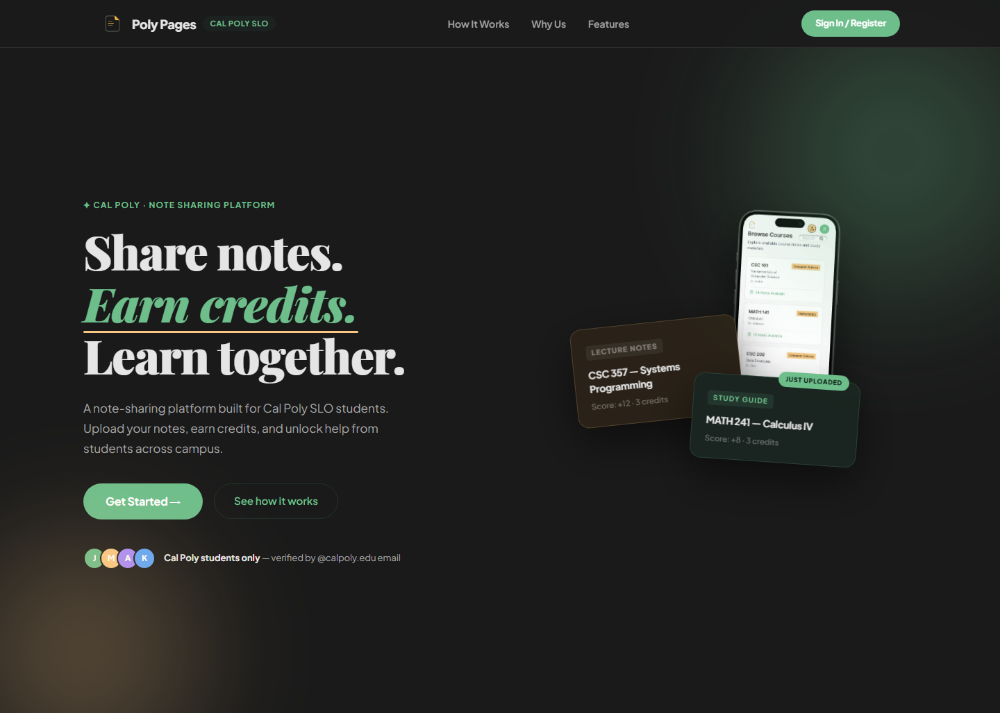

# Poly Pages

Poly Pages is a full-stack note-sharing platform for Cal Poly SLO students. Students upload class notes, earn credits when their work is approved, and spend credits to unlock useful study material from other students.

The project combines a searchable Cal Poly course catalog, `@calpoly.edu` email verification, PDF uploads, private Supabase storage, generated previews, a credit economy, voting, bookmarks, leaderboard stats, and moderator tools. It is built like a real campus product: useful to students, scoped to one school, and designed with academic-integrity guardrails.

[polypages.dev](https://www.polypages.dev/)



## What It Does

- Uses `@calpoly.edu` email verification to keep the community campus-scoped.
- Lets students browse courses, upload PDFs, preview resources, bookmark notes, and download with credits.
- Rewards contribution through upload credits, voting, profile stats, and leaderboard activity.
- Gives moderators a review surface for resources, reports, users, and promotions.
- Keeps original files private and serves access through app-controlled signed URLs.

## CodeBox

Poly Pages was built through CodeBox, a Cal Poly student software club. CodeBox teams work like small product teams: PMs, designers, tech leads, and developers build real apps together over the year.

## Tech Stack

- Next.js 16, React 19, TypeScript
- Supabase Auth, Postgres, and Storage
- Resend for email
- Jest for focused unit tests
- ESLint and Prettier for code quality

## Team

| Name | Role | Links |
| --- | --- | --- |
| Anthony Orozco | Product Manager | - |
| Joshua Panicker | Tech Lead | [LinkedIn](https://www.linkedin.com/in/joshua-panicker-32610a2b0), [GitHub](https://github.com/joshuapanicker) |
| Jonah Chan | Tech Lead | [LinkedIn](https://www.linkedin.com/in/jonah-chan), [GitHub](https://github.com/p1an0guy) |
| Isaiah Cortez | Designer | [LinkedIn](https://www.linkedin.com/in/isaiah-cortez9/), [GitHub](https://github.com/isaiah600) |
| Noah Gullo | Developer | [LinkedIn](https://www.linkedin.com/in/noah-gullo), [GitHub](https://github.com/Noah-Gullo) |
| Victor Xie | Developer | [LinkedIn](https://www.linkedin.com/in/victor-xie-767626301/), [GitHub](https://github.com/XieVic978), [GitHub alt](https://github.com/xievic9780) |
| Carter Lim | Developer | [GitHub](https://github.com/carter-a-lim) |
| Emma Walker | Developer | [GitHub](https://github.com/ema-png) |
| Wieland Rodriguez | Developer | [LinkedIn](https://www.linkedin.com/in/wieland-rodriguez), [GitHub](https://github.com/wielandrod) |

## Contributing

Install:

- Node.js 18+
- npm
- Supabase CLI if you are working with the database

Ask a lead for the values needed in `frontend/.env.local`:

```env
NEXT_PUBLIC_SUPABASE_URL=
NEXT_PUBLIC_SUPABASE_ANON_KEY=
SUPABASE_SERVICE_ROLE_KEY=
```

Clone and run:

```bash
git clone https://github.com/codebox-calpoly/NoteSharer.git
cd NoteSharer
npm run setup
```

Use branches and PRs:

```bash
git checkout main
git pull
git checkout -b short-clear-branch-name
npm run gitcheck
```

Open pull requests into `main`. Keep PRs focused, include screenshots for UI changes, and call out database or environment changes clearly.

## Docs

- [Architecture](docs/architecture.md): how the app is organized.
- [Product Goals](docs/product-goals.md): users, core flows, and product guardrails.
- [Brand](docs/brand.md): product voice, visual direction, and naming.
- [Code Style](docs/code-style.md): project coding conventions.
- [Testing](docs/testing.md): current checks and test expectations.
- [Agent Guide](AGENTS.md): working rules for AI collaborators.
- [Supabase Setup](supabase/README.md): database setup, migrations, and storage buckets.
